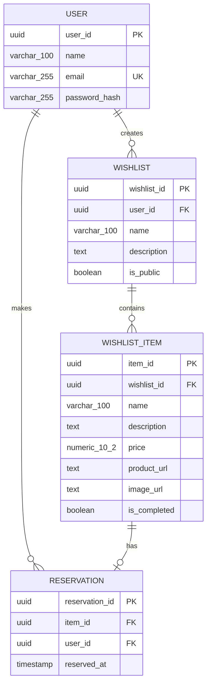

# Лабораторна робота №1. Збір вимог та розробка схеми ER

## Мета

Метою роботи є отримання практичних навичок збору та аналізу вимог, ключових елементів даних, бізнес-правил, завдань користувачів, створення ERD для систем на обраному прикладі (домені).

## Завдання

- Зібрати та задокументувати вимоги
- Ідентифікувати сутності та атрибути
- Визначити зв'язки між сутностями
- Розробити ER-діаграму
- Сформувати обмеження

---

# Обраний домен

## Веб-сервіс для створення та поширення списків бажань (Wishlist Service)

Система призначена для зберігання персональних списків бажань користувачів. Користувач може створювати власні списки, додавати до них бажані товари із зазначенням назви, опису, орієнтовної ціни та посилання на сторінку товару в інтернет-магазині.

Користувач може зробити свій список публічним та поділитися ним з іншими людьми. Інші користувачі системи можуть переглядати доступні бажання та резервувати конкретні товари, які вони планують придбати як подарунок. Інформація про те, хто саме зарезервував бажання, не відображається власнику списку, щоб зберегти елемент сюрпризу.

---

# 1. Вимоги до системи

## Призначення системи

Проектується веб-сервіс для створення, зберігання та поширення персональних списків бажань користувачів.

Головною метою системи є спрощення процесу формування списків подарунків та координації між людьми, які хочуть придбати подарунок для певного користувача. Система дозволяє користувачам створювати декілька списків бажань, додавати до них бажані товари із зовнішніх інтернет-магазинів та ділитися списками з іншими користувачами.

Інші користувачі можуть переглядати публічні списки та резервувати окремі бажання, щоб повідомити інших потенційних покупців, що цей подарунок уже планується до придбання. При цьому власник списку не бачить інформацію про особу, яка здійснила резервування.

Система повинна забезпечувати зберігання інформації про користувачів, їхні списки бажань, додані товари та резервування. На основі цих даних система повинна підтримувати створення та редагування списків, додавання і видалення бажань, перегляд публічних списків та резервування бажаних товарів.

## Ключові дані для зберігання

### Користувачі

Система повинна зберігати інформацію про зареєстрованих користувачів.

Для кожного користувача необхідно зберігати:

- унікальний ідентифікатор;
- ім'я;
- адресу електронної пошти;
- хеш пароля.

Email користувача повинен бути унікальним, оскільки один обліковий запис повинен відповідати одній електронній адресі.

Один користувач може створювати декілька списків бажань та резервувати декілька бажань інших користувачів.

### Списки бажань

Користувач повинен мати можливість створювати декілька списків бажань.

Для кожного списку необхідно зберігати:

- унікальний ідентифікатор;
- назву;
- опис;
- інформацію про власника;
- статус видимості списку.

Список може бути **публічним** або **приватним**.

Публічний список може бути переглянутий іншими користувачами, тоді як приватний доступний лише його власнику.

### Бажання (Wishlist Items)

Кожен список може містити декілька бажань.

Бажання представляє конкретний товар, який користувач хотів би отримати.

Для кожного бажання необхідно зберігати:

- унікальний ідентифікатор;
- назву товару;
- опис;
- орієнтовну ціну;
- посилання на сторінку товару;
- посилання на зображення товару;
- список, до якого воно належить;
- ознаку того, чи було бажання здійснене.

### Резервування

Користувачі повинні мати можливість резервувати бажання з публічних списків інших користувачів.

Для кожного резервування необхідно зберігати:

- унікальний ідентифікатор;
- бажання, яке було зарезервовано;
- користувача, який здійснив резервування;
- дату та час резервування.

Резервування використовується для того, щоб декілька людей не планували придбати один і той самий подарунок. Для одного бажання може існувати лише одне поточне резервування.

Власник wishlist не повинен бачити інформацію про користувача, який зарезервував його бажання.

## Основні операції системи

Система повинна дозволяти:

1. Зареєструвати нового користувача.
2. Створювати та редагувати списки бажань.
3. Робити список публічним або приватним.
4. Додавати бажання до списку.
5. Редагувати та видаляти бажання.
6. Переглядати власні списки бажань.
7. Переглядати публічні списки інших користувачів.
8. Резервувати бажання з публічних списків.
9. Скасовувати власне резервування.
10. Позначати власне бажання як здійснене.
11. Переглядати статус резервування власником списку без розкриття особи резервуючого.

---

# Бізнес-правила та обмеження

1. Кожен користувач має унікальну адресу електронної пошти.
2. Один користувач може мати декілька списків бажань, а кожен список бажань належить рівно одному користувачу.
3. Один список бажань може містити багато бажань, а кожне бажання належить рівно одному списку.
4. Приватний список не може переглядатися іншими користувачами.
5. Резервувати можна лише бажання з публічного списку.
6. Одне бажання може мати не більше одного активного резервування одночасно.
7. Один користувач може зарезервувати декілька бажань.
8. Користувач не повинен мати можливості зарезервувати власне бажання.
9. Власник вішлісту не бачить особу користувача, який зарезервував його бажання.
10. Резервування можна скасувати. Після скасування запис резервування видаляється, а бажання знову стає доступним для резервування.
11. Орієнтовна ціна бажання повинна бути більшою або дорівнювати нулю.
12. Здійснене бажання (`is_completed = true`) не може бути зарезервоване.
13. Здійсненим бажання може позначити лише власник відповідного списку бажань.
14. Якщо зарезервоване бажання позначається як здійснене, його поточне резервування скасовується.
15. Посилання на товар може вести на зовнішній інтернет-магазин.

---

# 2. Сутності та атрибути

## 2.1. User — Користувач

**Призначення:** зберігає інформацію про зареєстрованих користувачів системи.

| Атрибут         | Опис                                 | Тип даних      | Ключ             |
| --------------- | ------------------------------------ | -------------- | ---------------- |
| `user_id`       | Унікальний ідентифікатор користувача | `UUID`         | PK, NOT NULL     |
| `name`          | Ім'я користувача                     | `VARCHAR(100)` | NOT NULL         |
| `email`         | Електронна адреса користувача        | `VARCHAR(255)` | UNIQUE, NOT NULL |
| `password_hash` | Хеш пароля облікового запису         | `VARCHAR(255)` | NOT NULL         |

## 2.2. Wishlist — Список бажань

**Призначення:** зберігає інформацію про список бажань користувача.

| Атрибут       | Опис                            | Тип даних      | Ключ                   |
| ------------- | ------------------------------- | -------------- | ---------------------- |
| `wishlist_id` | Унікальний ідентифікатор списку | `UUID`         | PK, NOT NULL           |
| `user_id`     | Ідентифікатор власника списку   | `UUID`         | FK, NOT NULL           |
| `name`        | Назва списку                    | `VARCHAR(100)` | NOT NULL               |
| `description` | Опис списку                     | `TEXT`         | NULL                   |
| `is_public`   | Ознака публічності списку       | `BOOLEAN`      | NOT NULL, DEFAULT TRUE |

## 2.3. WishlistItem — Бажання

**Призначення:** зберігає інформацію про конкретний товар, доданий до списку бажань.

| Атрибут        | Опис                                            | Тип даних       | Ключ                    |
| -------------- | ----------------------------------------------- | --------------- | ----------------------- |
| `item_id`      | Унікальний ідентифікатор бажання                | `UUID`          | PK, NOT NULL            |
| `wishlist_id`  | Ідентифікатор списку, до якого належить бажання | `UUID`          | FK, NOT NULL            |
| `name`         | Назва бажаного товару                           | `VARCHAR(100)`  | NOT NULL                |
| `description`  | Опис товару                                     | `TEXT`          | NULL                    |
| `price`        | Орієнтовна ціна товару                          | `NUMERIC(10,2)` | NOT NULL, >= 0          |
| `product_url`  | Посилання на товар                              | `TEXT`          | NULL                    |
| `image_url`    | Посилання на зображення товару                  | `TEXT`          | NULL                    |
| `is_completed` | Ознака того, чи було бажання здійснене          | `BOOLEAN`       | NOT NULL, DEFAULT FALSE |

## 2.4. Reservation — Резервування

**Призначення:** зберігає інформацію про поточне резервування конкретного бажання.

| Атрибут          | Опис                                                  | Тип даних   | Ключ                 |
| ---------------- | ----------------------------------------------------- | ----------- | -------------------- |
| `reservation_id` | Унікальний ідентифікатор резервування                 | `UUID`      | PK, NOT NULL         |
| `item_id`        | Ідентифікатор зарезервованого бажання                 | `UUID`      | FK, UNIQUE, NOT NULL |
| `user_id`        | Ідентифікатор користувача, який здійснив резервування | `UUID`      | FK, NOT NULL         |
| `reserved_at`    | Дата та час резервування                              | `TIMESTAMP` | NOT NULL             |

> `Reservation` зберігає лише поточне резервування. Окремий атрибут `status` не використовується: при скасуванні резервування відповідний запис видаляється.

---

# 3. Зв'язки між сутностями

## 3.1. User — Wishlist

**Тип зв'язку:** 1:N (один-до-багатьох)

Один користувач може створити **декілька списків бажань**, але кожен список бажань належить **лише одному користувачу**.

- User → Wishlist: 1:N
- Зовнішній ключ: `Wishlist.user_id → User.user_id`

## 3.2. Wishlist — WishlistItem

**Тип зв'язку:** 1:N (один-до-багатьох)

Один список бажань може містити **декілька бажань**, але кожне бажання належить **лише одному списку**.

- Wishlist → WishlistItem: 1:N
- Зовнішній ключ: `WishlistItem.wishlist_id → Wishlist.wishlist_id`

## 3.3. User — Reservation

**Тип зв'язку:** 1:N (один-до-багатьох)

Один користувач може створити **декілька резервувань**, але кожне резервування здійснюється **одним користувачем**.

- User → Reservation: 1:N
- Зовнішній ключ: `Reservation.user_id → User.user_id`

## 3.4. WishlistItem — Reservation

**Тип зв'язку:** 1:0..1 (один-до-нуль-або-одного)

Одне бажання може **не мати резервування або мати лише одне поточне резервування**. Кожне резервування стосується лише одного бажання.

- WishlistItem → Reservation: 1:0..1
- Зовнішній ключ: `Reservation.item_id → WishlistItem.item_id`
- Додаткове обмеження: `Reservation.item_id UNIQUE`

---

# 4. ER-діаграма

